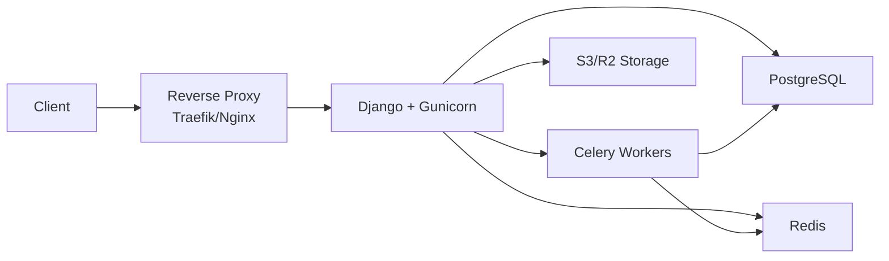

FootyCollect can be deployed to production using either Docker Compose or directly on a VPS (bare metal). This section guides you through both deployment methods, environment configuration, and production best practices.

## Deployment Options

Choose the deployment method that best fits your infrastructure:

<CardGroup cols={2}>
  <Card title="Docker Production" icon="docker" href="/deployment/docker-production">
    Deploy the full stack with Docker Compose including Django, PostgreSQL, Redis, Traefik, and Celery workers
  </Card>
  <Card title="Bare Metal VPS" icon="server" href="/deployment/bare-metal">
    Deploy directly on Ubuntu/Debian servers using Nginx, Gunicorn, and systemd services
  </Card>
</CardGroup>

## Architecture Overview

FootyCollect production deployment consists of these core components:



### Core Services

| Service | Purpose | Required |
|---------|---------|----------|
| **Django + Gunicorn** | Application server | Yes |
| **PostgreSQL** | Database | Yes |
| **Redis** | Cache and Celery broker | Yes |
| **Celery Worker** | Background tasks (image downloads) | Recommended |
| **Celery Beat** | Scheduled tasks | Recommended |
| **Nginx/Traefik** | Reverse proxy and SSL termination | Yes |
| **S3/R2** | Static and media file storage | Recommended |

## Requirements

### System Requirements

<Tabs>
  <Tab title="Docker">
    - Docker Engine 20.10+
    - Docker Compose v2+
    - 2GB RAM minimum (4GB recommended)
    - 20GB disk space
    - Ubuntu 20.04+ or Debian 11+
  </Tab>
  <Tab title="Bare Metal">
    - Ubuntu 20.04+ or Debian 11+
    - Python 3.12+
    - PostgreSQL 14+
    - Redis 6+
    - Nginx
    - 2GB RAM minimum (4GB recommended)
    - 20GB disk space
  </Tab>
</Tabs>

### External Services

| Service | Purpose | Required |
|---------|---------|----------|
| **Domain name** | SSL certificates and production access | Yes |
| **SendGrid** | Email delivery | Recommended |
| **Sentry** | Error tracking and monitoring | Recommended |
| **AWS S3 or Cloudflare R2** | Static and media file storage | Recommended |
| **FKAPI** | Football Kit Archive integration | Optional |

<Warning>
  **Domain Required**: You need a domain name for SSL certificates. Let's Encrypt cannot issue certificates for IP addresses.
</Warning>

## Quick Start

<Steps>
  <Step title="Choose Deployment Method">
    Select either [Docker production](/deployment/docker-production) for containerized deployment or [bare metal](/deployment/bare-metal) for traditional VPS deployment.
  </Step>
  
  <Step title="Configure Environment">
    Set up production environment variables following the [environment setup guide](/deployment/environment-setup). Generate a secure `SECRET_KEY` and configure database, Redis, email, and storage.
  </Step>
  
  <Step title="Deploy Application">
    Follow the deployment guide for your chosen method. Both guides include database setup, static file collection, and SSL configuration.
  </Step>
  
  <Step title="Verify Deployment">
    Complete the [production checklist](/deployment/production-checklist) to ensure all security settings are configured and run Django's deployment checks.
  </Step>
</Steps>

## Static and Media Files

In production, FootyCollect serves static and media files from S3-compatible storage:

### Storage Options

<AccordionGroup>
  <Accordion title="AWS S3" icon="aws">
    Configure AWS S3 for production static and media files:
    
    ```bash
    STORAGE_BACKEND=aws
    DJANGO_AWS_ACCESS_KEY_ID=your-access-key
    DJANGO_AWS_SECRET_ACCESS_KEY=your-secret-key
    DJANGO_AWS_STORAGE_BUCKET_NAME=your-bucket
    DJANGO_AWS_S3_REGION_NAME=us-east-1
    DJANGO_AWS_S3_CUSTOM_DOMAIN=cdn.yourdomain.com  # Optional CDN
    ```
    
    Static files are uploaded during deployment with `collectstatic`.
  </Accordion>
  
  <Accordion title="Cloudflare R2" icon="cloudflare">
    Configure Cloudflare R2 for cost-effective S3-compatible storage:
    
    ```bash
    STORAGE_BACKEND=r2
    CLOUDFLARE_ACCESS_KEY_ID=your-access-key
    CLOUDFLARE_SECRET_ACCESS_KEY=your-secret-key
    CLOUDFLARE_BUCKET_NAME=your-bucket
    CLOUDFLARE_R2_ENDPOINT_URL=https://account-id.r2.cloudflarestorage.com
    CLOUDFLARE_R2_CUSTOM_DOMAIN=cdn.yourdomain.com  # Optional
    ```
    
    R2 offers free egress bandwidth with S3-compatible API.
  </Accordion>
  
  <Accordion title="Local Storage (Not Recommended)" icon="folder">
    For testing only, you can serve files locally via Nginx:
    
    ```nginx
    location /static/ {
        alias /var/www/footycollect/staticfiles/;
        expires 30d;
    }
    
    location /media/ {
        alias /var/www/footycollect/media/;
        expires 7d;
    }
    ```
    
    <Warning>
      Local storage doesn't scale and complicates multi-server deployments. Use S3/R2 for production.
    </Warning>
  </Accordion>
</AccordionGroup>

## Security Considerations

<Warning>
  **Critical Security Settings**
  
  Never deploy to production without configuring these settings:
  - `DEBUG=False` - Prevents sensitive information exposure
  - Strong `SECRET_KEY` - Generate with Django's `get_random_secret_key()`
  - `ALLOWED_HOSTS` - Restrict to your domain(s)
  - `SECURE_SSL_REDIRECT=True` - Force HTTPS
  - SSL/TLS certificates - Use Let's Encrypt (free)
</Warning>

### Security Checklist

- [ ] DEBUG disabled (`DEBUG=False`)
- [ ] Unique SECRET_KEY generated and secured
- [ ] ALLOWED_HOSTS configured with actual domain(s)
- [ ] SSL/TLS certificates installed
- [ ] Firewall configured (UFW or similar)
- [ ] Fail2ban enabled for SSH protection
- [ ] Strong database password set
- [ ] Regular security updates enabled
- [ ] Sentry configured for error tracking
- [ ] Database backups automated

See the [production checklist](/deployment/production-checklist) for the complete security configuration.

## Monitoring and Health Checks

FootyCollect includes built-in health check endpoints:

| Endpoint | Purpose |
|----------|--------|
| `/health/` | Basic health check (200 OK if running) |
| `/ready/` | Readiness check (includes database connectivity) |

### Django Deployment Checks

Run Django's built-in deployment checks before going live:

```bash
python manage.py check --deploy
```

This validates:
- DEBUG is disabled
- SECRET_KEY is secure
- ALLOWED_HOSTS is configured
- Database connectivity
- Redis connectivity
- SSL/HTTPS settings
- Storage credentials (S3/R2)

See config/checks.py:1 for all production validation checks.

## Database Backups

Both deployment methods include automatic database backups:

**Docker**: Uses the `awscli` container for automated backups to S3

**Bare Metal**: Automated backups during deployment via `deploy.sh`

### Manual Backup

```bash
# Backup database
sudo -u postgres pg_dump footycollect_db > backup_$(date +%Y%m%d).sql

# Restore database
sudo -u postgres psql footycollect_db < backup_20260302.sql
```

## Next Steps

<CardGroup cols={2}>
  <Card title="Docker Deployment" icon="docker" href="/deployment/docker-production">
    Deploy with Docker Compose for containerized production environment
  </Card>
  <Card title="Bare Metal Deployment" icon="server" href="/deployment/bare-metal">
    Deploy on Ubuntu/Debian VPS with Nginx and Gunicorn
  </Card>
  <Card title="Environment Setup" icon="gear" href="/deployment/environment-setup">
    Configure production environment variables and secrets
  </Card>
  <Card title="Production Checklist" icon="check" href="/deployment/production-checklist">
    Complete pre-deployment security and configuration checklist
  </Card>
</CardGroup>

## Support

For deployment issues:
- Check the troubleshooting sections in [Docker](/deployment/docker-production#troubleshooting) or [bare metal](/deployment/bare-metal#troubleshooting) guides
- Review deployment logs and Django checks
- Open an issue on [GitHub](https://github.com/sunr4y/FootyCollect/issues)
